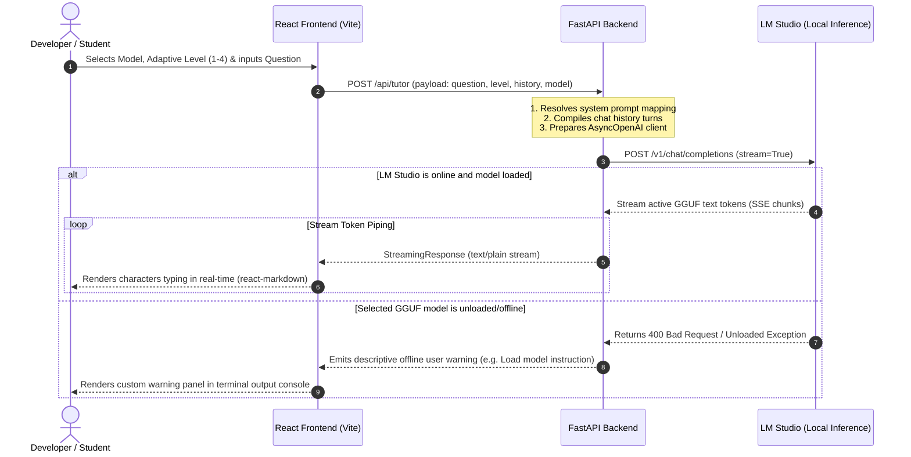

# 🤖 Vortex - Adaptive LLM-Based AI Tutor

<div align="center">
  
  
  ### *An Adaptive, Multi-Level LLM Pedagogical Assistant*
  
  [](https://fastapi.tiangolo.com)
  [](https://react.dev)
  [](https://tailwindcss.com)
  [](https://lmstudio.ai)
  
  ---
  
  ### 🎓 Udemy Course Project
  This is **Project 3** of the highly acclaimed Udemy course: **[LLM Engineering, RAG, & AI Agents Masterclass [2026]]**. It has been built and significantly enhanced from the initial Jupyter Notebook course work into a premium, state-of-the-art **Fullstack Web App + AI Integration**.
</div>

---

## 🌌 Overview

**Vortex** is a premium, state-of-the-art Adaptive AI Tutoring platform. It enables students and software developers to query complex technical topics and receive pedagogical explanations that automatically adapt in depth and terminology according to the user's level of expertise. 

Vortex bridges the gap between local LLM orchestration and premium web UI design. Powered by **LM Studio** (running local GGUF models) or any OpenAI-compatible API, the system guides users through concepts with a tailored learning curve:

*   **Level 1: Student Persona** — Uses simple everyday analogies, visual comparisons, friendly language, and avoids dense jargon.
*   **Level 2: Junior Developer** — Focuses on practical code snippets, core syntax, common usage, getting started routines, and common pitfalls to avoid.
*   **Level 3: Senior Developer** *(Default)* — Emphasizes architectural patterns, design choices, trade-offs, scalability, testing, and production refactoring principles.
*   **Level 4: Expert Architect** — Dives deep into low-level engine internals, compilation processes, memory management, concurrency safety, and performance benchmarks.

---

## 🏗️ Architecture & System Flow

Vortex is structured as a decoupled, three-tier local ecosystem:

1.  **Frontend (UI Client)**: A modern, high-fidelity React + Tailwind CSS v4 + Vite Single Page Application featuring interactive, level-dependent glowing particle backdrops, live streaming markdown rendering with syntax-highlighted code cells, and persistent session histories.
2.  **Backend (API Server)**: A robust FastAPI application that handles routing, server-sent token streaming, conversation history construction, dynamic prompt wrapping, and smart fallbacks.
3.  **Local Inference Engine (LLM Hub)**: LM Studio hosting local high-performance instruction models (e.g., Llama-3.1-8B, Qwen-2.5-7B) over a standardized local server endpoint.

### 🔄 Communication & Token Flow



---

## 📓 The Prototyping Phase: Jupyter Notebook & Gradio

The repository includes a standalone prototype notebook: 
[`An Adaptive LLM-Based AI Tutor with Gradio.ipynb`](file:///c:/Users/Administrator/Desktop/Udemy%20Course%20%5BLLM%20Engineering,%20RAG,%20&%20AI%20Agents%20Masterclass%20%5B2026%5D%5D/An%20Adaptive%20LLM-Based%20AI%20Tutor%20with%20Gradio/An%20Adaptive%20LLM-Based%20AI%20Tutor%20with%20Gradio.ipynb)

This notebook documents the **rapid prototyping phase** of the Vortex project, demonstrating the transition from raw python LLM integration to a functional web layout using the **Gradio** library.

### Key Notebook Components:
1.  **Dependency Preparation**: Automates installation of standard dependencies (`openai`, `python-dotenv`, `gradio`).
2.  **LM Studio Client Initialization**: Loads `.env` configuration (e.g., `LM_STUDIO_BASE_URL`) and initializes a standard `OpenAI` client pointing to local models.
3.  **Model Retrieval Interface**: Implements programmatic querying of currently loaded models in LM Studio using `openai_client.models.list()`.
4.  **Pedagogical Prompt Mappings**: Houses the initial structure of the adaptive persona mapping (`student`, `junior`, `senior`, `Expert`).
5.  **Gradio Streaming Interface**: Consolidates the backend explanation logic into an interactive web preview. The UI compiles a custom textbox for input, a model choice dropdown, an explanation level slider, and a streaming Markdown response container.

> [!NOTE]
> The notebook served as the architecture's playground, proving that GGUF tokens could be streamed dynamically to a markdown interface locally before scaling to a dedicated React and FastAPI system.

---

## 🐍 Backend Architecture (`backend/main.py`)

The production backend is located inside the [`backend/`](file:///c:/Users/Administrator/Desktop/Udemy%20Course%20%5BLLM%20Engineering,%20RAG,%20&%20AI%20Agents%20Masterclass%20%5B2026%5D%5D/An%20Adaptive%20LLM-Based%20AI%20Tutor%20with%20Gradio/backend) folder and driven by [`main.py`](file:///c:/Users/Administrator/Desktop/Udemy%20Course%20%5BLLM%20Engineering,%20RAG,%20&%20AI%20Agents%20Masterclass%20%5B2026%5D%5D/An%20Adaptive%20LLM-Based%20AI%20Tutor%20with%20Gradio/backend/main.py). It operates on a **FastAPI** server that communicates asynchronously with LM Studio using the `AsyncOpenAI` client.

### Key Features:

*   **Dynamic System Persona Adaptation**:
    The backend maps incoming `explanation_level` values (1-4) to detailed instructional prompts:
    *   **Level 1 (Student)**: *"explain as a student... use simple everyday analogies... avoid dense industry jargon."*
    *   **Level 2 (Junior Dev)**: *"explain as a junior developer... focus on practical code samples, core syntax, and common gotchas."*
    *   **Level 3 (Senior Dev)**: *"explain as a senior developer... discuss architectural patterns, trade-offs, scalability, and testability."*
    *   **Level 4 (Expert/Principal)**: *"explain as a principal engineer... dive deep into engine internals, low-level mechanics, performance benchmarks, and compilation."*

*   **Smart Model Fallback Handling**:
    When querying `GET /api/models`, the API attempts to fetch models from the active local LM Studio instance. If LM Studio is not running, the backend avoids crashing and gracefully returns a curated list of popular instruction-tuned developer models (e.g. `qwen2.5-7b-instruct`, `meta-llama-3.1-8b-instruct`) alongside a warning status, ensuring a seamless fallback developer experience.

*   **Asynchronous SSE Token Generator**:
    The main `/api/tutor` endpoint accepts a `TutorRequest` payload containing the active question, selection model, history, and level. It spins up a streaming generator that:
    1.  Compiles the system prompt.
    2.  Injects the sequential chat turns history.
    3.  Pipes the asynchronous chunks in real-time.
    4.  Catches active model unloaded states (returns exact instructions on how to load models inside LM Studio).

### Backend Endpoints:

| Method | Endpoint | Description |
|---|---|---|
| `GET` | `/api/health` | Diagnostic status check, reporting active connection values. |
| `GET` | `/api/models` | Queries active GGUF models or supplies developer fallback candidates. |
| `POST` | `/api/tutor` | Accepts user payload and starts real-time pedagogical token streaming. |

---

## ⚛️ Frontend Architecture (`frontend/`)

The user interface is a premium React web application structured to provide an immersive, premium "IDE-like" developer environment.

### 🎨 Visual Identity & Custom Logo
Vortex features a customized visual system centered around a custom high-tech glowing logo (`vortex_logo.png`) that captures a geometric letter 'V' transforming into a swirling galaxy of digital nodes. The logo is integrated into:
*   The **Header Navigation**, styled with an glass-morphic border gradient.
*   The **Chat Workspace Empty State**, appearing as a larger glowing beacon awaiting inquiry.

### Component Design Matrix:

1.  **`App.jsx` ([App.jsx](file:///c:/Users/Administrator/Desktop/Udemy%20Course%20%5BLLM%20Engineering,%20RAG,%20&%20AI%20Agents%20Masterclass%20%5B2026%5D%5D/An%20Adaptive%20LLM-Based%20AI%20Tutor%20with%20Gradio/frontend/src/App.jsx))**:
    Serves as the root orchestrator of global state. It handles model fetches, streams state from the API utility layer, monitors responsive window breakpoints, and syncs past discussions to the persistent localStorage workspace log (`vortex_tutor_history`).
    
2.  **`GlowingBackground.jsx` ([GlowingBackground.jsx](file:///c:/Users/Administrator/Desktop/Udemy%20Course%20%5BLLM%20Engineering,%20RAG,%20&%20AI%20Agents%20Masterclass%20%5B2026%5D%5D/An%20Adaptive%20LLM-Based%20AI%20Tutor%20with%20Gradio/frontend/src/components/GlowingBackground.jsx))**:
    Creates a beautiful glassmorphic visual system. It maps ambient blurred gradient blobs to the active adaptation level. As the user changes the slider, the background color transitions seamlessly (e.g., Teal for Students, Indigo for Seniors, Violet for Experts).

3.  **`ConfigPanel.jsx` ([ConfigPanel.jsx](file:///c:/Users/Administrator/Desktop/Udemy%20Course%20%5BLLM%20Engineering,%20RAG,%20&%20AI%20Agents%20Masterclass%20%5B2026%5D%5D/An%20Adaptive%20LLM-Based%20AI%20Tutor%20with%20Gradio/frontend/src/components/ConfigPanel.jsx))**:
    The control deck of the tutor. Houses the Model Select Dropdown (with automatic loading/refresh triggers) and the interactive Adaptive Level Slider. It details each role's focus to guide the user.

4.  **`ChatWorkspace.jsx` ([ChatWorkspace.jsx](file:///c:/Users/Administrator/Desktop/Udemy%20Course%20%5BLLM%20Engineering,%20RAG,%20&%20AI%20Agents%20Masterclass%20%5B2026%5D%5D/An%20Adaptive%20LLM-Based%20AI%20Tutor%20with%20Gradio/frontend/src/components/ChatWorkspace.jsx))**:
    The main interaction cockpit:
    *   **Curiosity Console**: A textarea with smart submittal keybinds (`Enter` submits, `Shift+Enter` makes newlines) and quick actions.
    *   **Terminal Output (`TUTORIAL_OUT.md`)**: Renders streaming markdown text via `react-markdown`.
    *   **Custom Code Card (`CustomCodeBlock`)**: Intercepts code elements in markdown and wraps them in custom syntax cards featuring one-click copy-to-clipboard buttons.
    *   **Blinking Cursor**: An elegant, typing chevron cursor indicator active during server-sent events.

5.  **`Sidebar.jsx` ([Sidebar.jsx](file:///c:/Users/Administrator/Desktop/Udemy%20Course%20%5BLLM%20Engineering,%20RAG,%20&%20AI%20Agents%20Masterclass%20%5B2026%5D%5D/An%20Adaptive%20LLM-Based%20AI%20Tutor%20with%20Gradio/frontend/src/components/Sidebar.jsx))**:
    Maintains a list of recent discussions allowing users to click and restore past chats instantly. Displays quick start suggestion prompts (e.g. React hooks, design patterns) to kickstart learning.

---

## 🚀 Getting Started & Local Deployment

Follow these steps to run the complete Vortex AI Tutor ecosystem on your local machine.

### 📋 Prerequisites
*   [Node.js](https://nodejs.org) (v18.0.0 or higher)
*   [Python](https://www.python.org/) (v3.10 or higher)
*   [LM Studio](https://lmstudio.ai/)

### 1. Configure the LLM Engine (LM Studio)
1.  Open **LM Studio**.
2.  Search and download an instruction-tuned model (e.g., `Qwen2.5-7B-Instruct` or `Llama-3.1-8B-Instruct`).
3.  Navigate to the **Local Server** tab (represented by a double arrow icon on the left sidebar).
4.  Select your downloaded model from the top dropdown to load it into memory.
5.  Set the port (default: `1234`) and click **Start Server**.
6.  Ensure the server status reads **Online** and is listening on `http://localhost:1234`.

### 2. Configure Environment Variables
In the root directory, configure the `.env` file containing:
```env
LM_STUDIO_BASE_URL=http://localhost:1234/v1
LM_STUDIO_API_KEY=lm-studio
```

### 3. Deploy the FastAPI Backend
Open a terminal in the root directory and execute:
```powershell
# Navigate to the backend directory
cd backend

# Create a virtual environment
python -m venv venv

# Activate the virtual environment
# Windows:
.\venv\Scripts\activate
# macOS/Linux:
source venv/bin/activate

# Install python dependencies
pip install -r requirements.txt

# Start the FastAPI Uvicorn reload server
python main.py
```
The backend server will run on `http://127.0.0.1:8000`. You can inspect the interactive OpenAPI documentation at `http://127.0.0.1:8000/docs`.

### 4. Launch the React Frontend
Open a new terminal window in the root directory and execute:
```powershell
# Navigate to the frontend directory
cd frontend

# Install package dependencies
npm install

# Start the Vite development hot-reload server
npm run dev
```
Vite will host the frontend dashboard on `http://localhost:5173`. Open this URL in your web browser to start using **Vortex AI Tutor**!

---

## 🛠️ Technology Stack Detail

### Frontend Tech
*   **Framework**: [React 19](https://react.dev) (Functional Components & Hooks)
*   **Styling**: [Tailwind CSS v4](https://tailwindcss.com) (Modern `@tailwindcss/postcss` compiler)
*   **Icons**: [Lucide React](https://lucide.dev)
*   **Markdown Parsing**: [React Markdown](https://github.com/remarkjs/react-markdown)
*   **Build Utility**: [Vite 8](https://vite.dev)

### Backend Tech
*   **Server Core**: [FastAPI](https://fastapi.tiangolo.com/) (Asynchronous ASGI framework)
*   **Server Handler**: [Uvicorn](https://www.uvicorn.org/) (High-performance ASGI server)
*   **Client Driver**: [AsyncOpenAI](https://github.com/openai/openai-python) (Asynchronous API execution)
*   **Configuration Manager**: [Python-dotenv](https://saurabh-kumar.com/python-dotenv/)
*   **Data Models**: [Pydantic v2](https://docs.pydantic.dev/)

---

## 📝 License
This project is open-source and licensed under the [MIT License](LICENSE). Feel free to adapt, tweak, and use it in your LLM and AI Agent research!
